# DAPPS # Solidity #Truffle
Se realiza la creacion de una cuenta en Rinkeby y se le agregaran fondos. (Dividido en 4 COMMITS en este mismo repositorio)

PASO - 1

Primero se creara la estructura con el constructor y la declaracion/conversion de unidades en eth

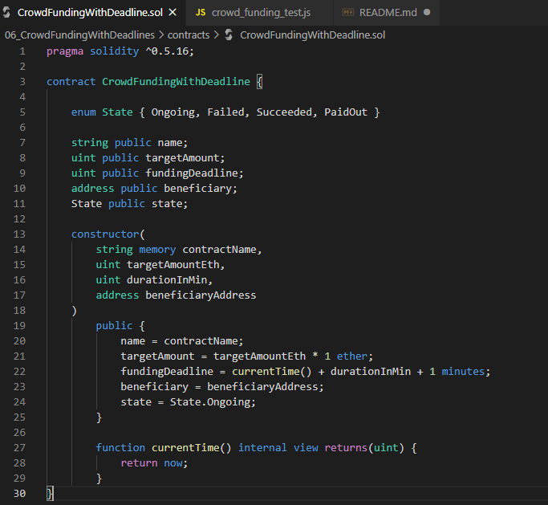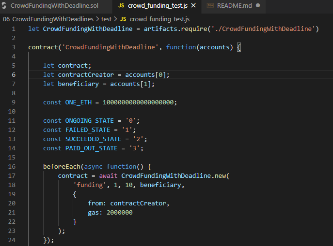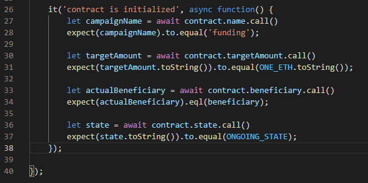

NOTA: tener mucho cuidado de usar toString en lugar de toNumber ya que al usar cantidades grandes (como en este caso el valor del ETH 1,000,000,000,000,000,000 al momento de compilar y ejecutar aparecera un error de que excede los 53 bytes).

La comprobacion de que todo esta funcionando correctamente es al ejecutar el comando "truffle test" para hacer uso del archivo "crowd_funding_test.js" nos debera mostrar en consola que paso de manera exitosa como se ve a continuacion:

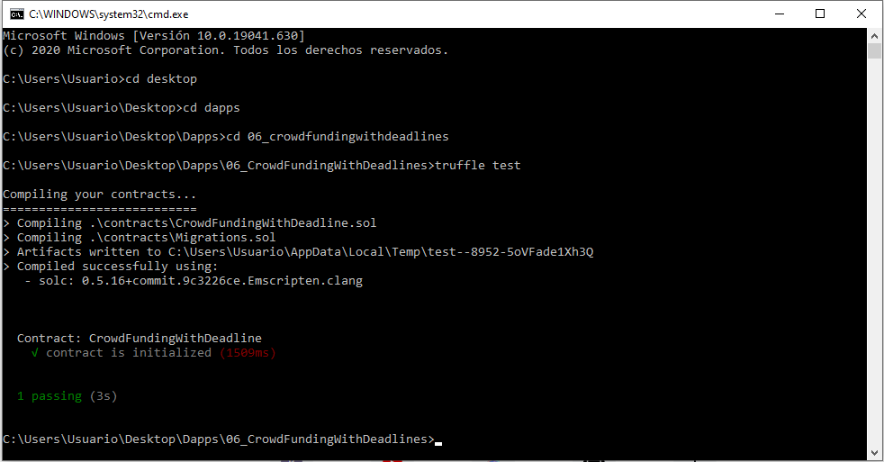

PASO - 2

Una vez que el contrato es inicializado de manera exitosa, se pasa a agregar fondos, para esto se añaden los modificadores, mientras que en el .js se agrega el metodo para llamar a llenar los fondos.

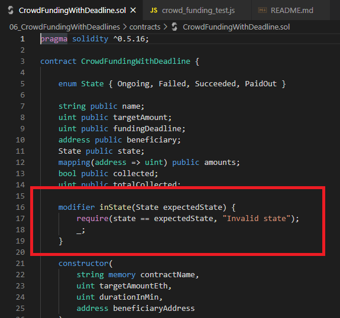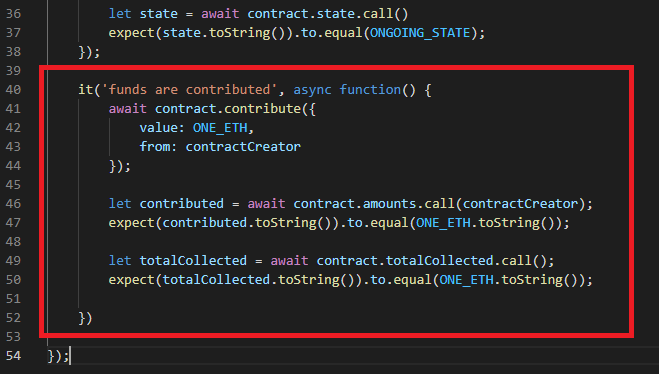

Para comprobar que se realizo de manera correcta lo ejecutamos como se ve a continuacion:

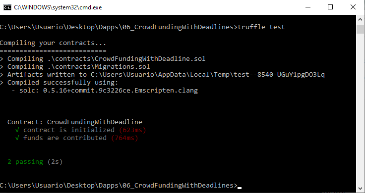

PASO 3

Aqui se implementa la herencia y se agrega la info para 3 acciones mas en el contrato las cuales consisten en 
el fundeo exitoso, el fondeo fallido y evitar contribucion fuera del tiempo, para ello dentro de nuestro archivo "crowdfundingwithdeadline.sol" añadimos las funciones y la instancia necesaria para evitar la contribufion fuera de tiempo limite.

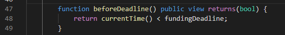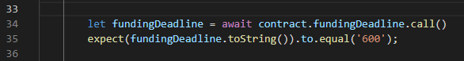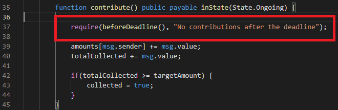

Una vez que tenemos las funciones, añadimos a nuestro .js el it correspondiente a cada una de estas nuevas funciones y una constante que necesitaremos

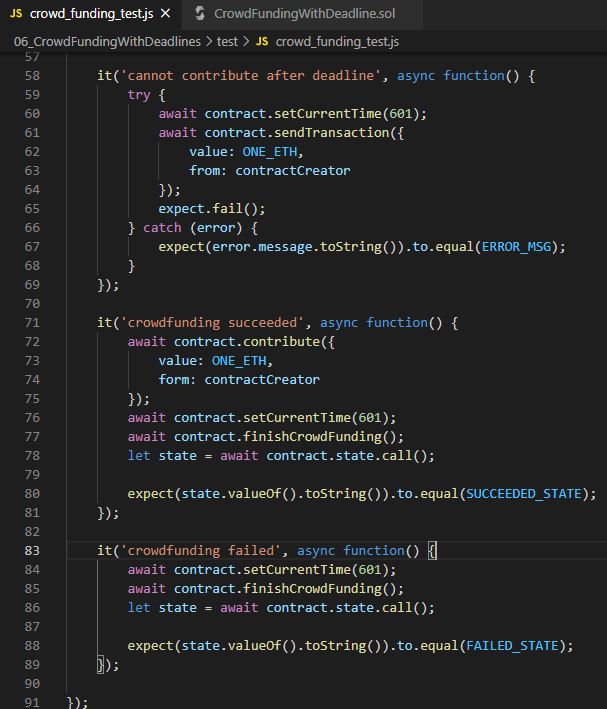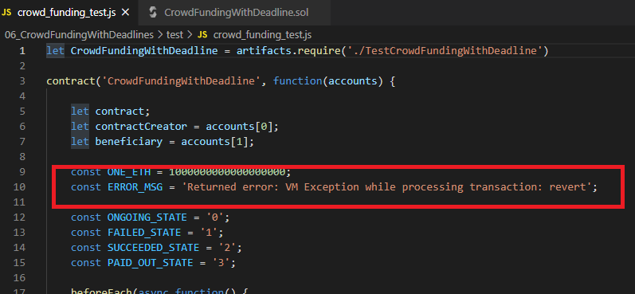

Aqui comprobamos ejecutando nuestro truffle para verificar que tenemos nuestros 5 passing funcionando correctamente como se ve a continuacion:

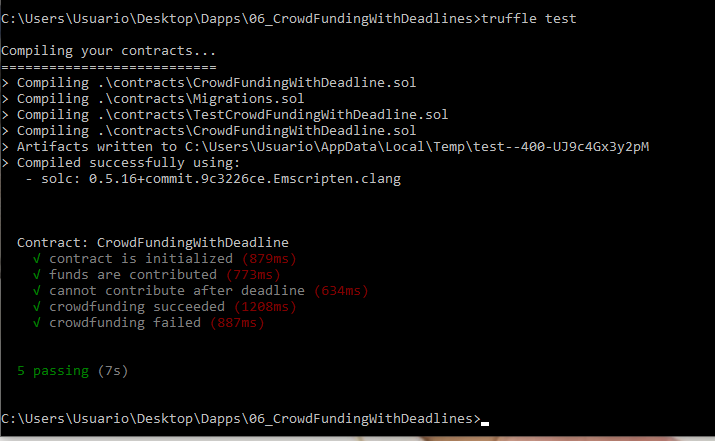

PASO 3 Complemento

Se agregan 2 metodos y sus 2 funciones correspondientes

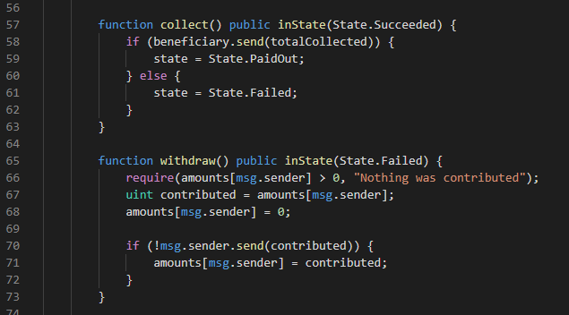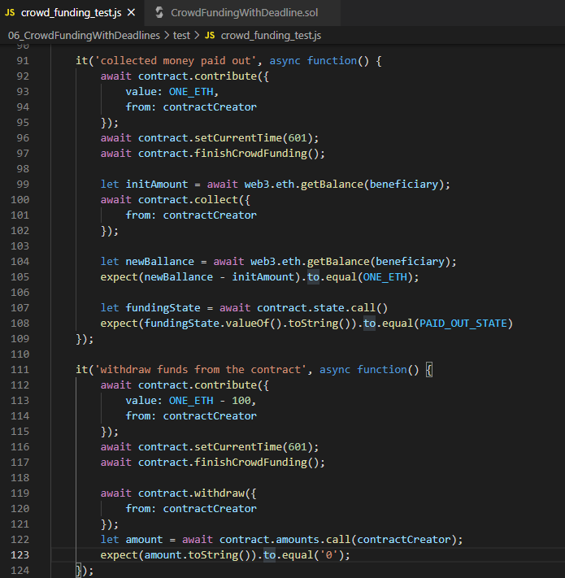

NOTA: aqui para que funcione correctamente todas las declaraciones de las variables beneficiary y beneficiaryAddress se tienen que pasar de tipo "address" a tipo "addres payable".

Ahora verificamos que funcione correctamente al ejecutarlo

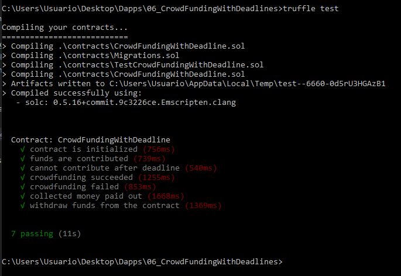